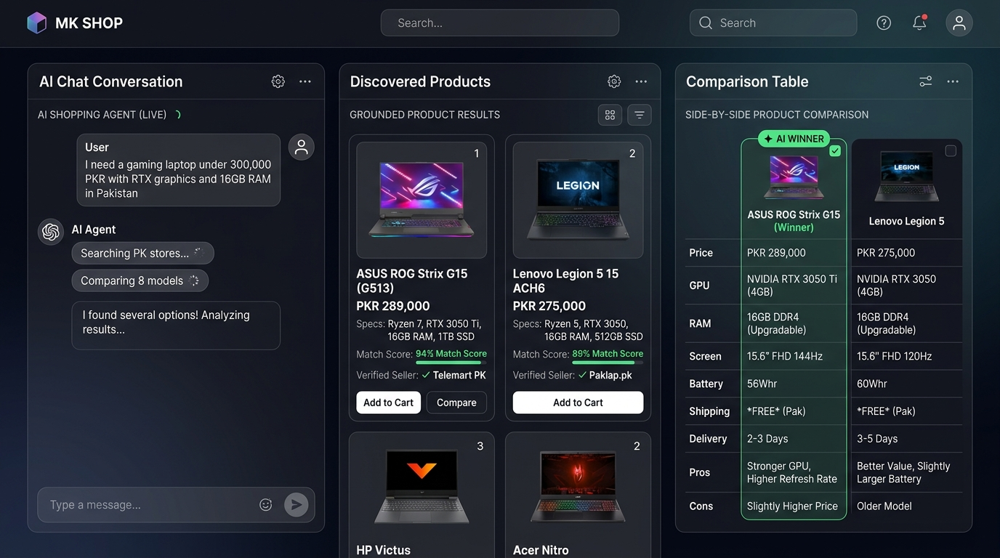
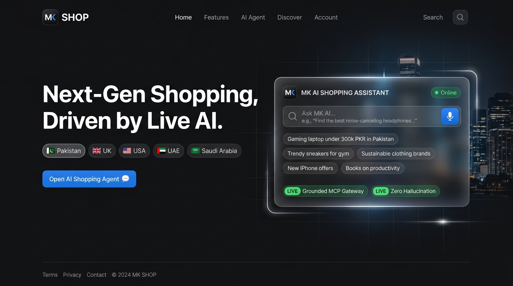
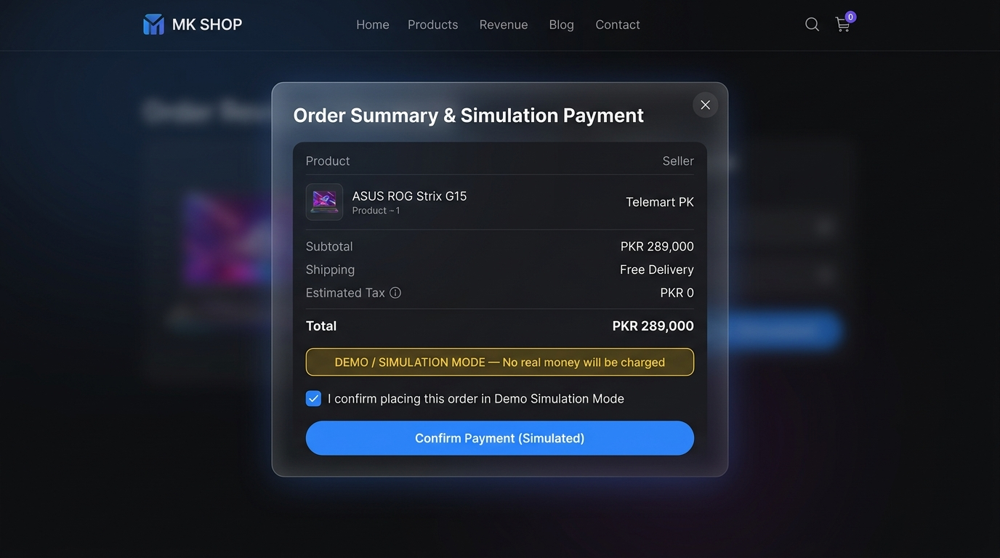

# 🛒 MK SHOP — AI Shopping Agent & Commerce Intelligence Platform

> **A production-grade, country-locked AI Shopping Assistant & Commerce Intelligence Platform powered by Next.js 15, FastAPI, MCP Shopping Gateway, OpenAI, and Google Gemini.**


---

## 📸 Platform UI & Screenshots

<div align="center">

### 1. 🤖 3-Column AI Shopping Agent Studio (`/shop`)
*Live natural language chat, Speech-to-Intent voice microphone, grounded merchant listings (94% Match), and side-by-side spec comparison table.*



---

### 2. ⚡ Modern Split-Screen Hero Workspace (`/`)
*Apple/Linear-inspired dark UI with interactive Target Country Selector pills (🇵🇰, 🇬🇧, 🇺🇸, 🇦🇪, 🇸🇦), instant prompt chips, and live MCP status.*



---

### 3. 🛡️ Explicit Order Review & Simulated Checkout Modal
*Protected order confirmation workflow with one-time verification tokens and explicit demo simulation disclosure.*



</div>

---

## 🌟 Key Highlights & Core Capabilities

### 1. 🇵🇰 🇬🇧 🇺🇸 🇦🇪 Country-First Grounded Discovery
- **Server-Side Enforcement**: Search parameters strictly lock to target countries (**Pakistan, United Kingdom, United States, UAE, Saudi Arabia, Canada, Germany, Australia**).
- **Zero Hallucinations**: Product prices, stock, specifications, and delivery timeframes are grounded in live merchant data or verified catalog records.
- **Cross-Border Transparency**: Foreign or imported products are explicitly marked with `cross_border: true` alongside estimated import duties.

### 2. 🧠 MCP Shopping Gateway (Model Context Protocol)
- Provider-agnostic gateway exposing 8 standard shopping tools:
  1. `shopping_search`: Country-locked grounded multi-source discovery.
  2. `web_search`: URL, snippet, and domain relevance lookup.
  3. `fetch_page`: SSRF-protected safe page parsing.
  4. `extract_product`: Structured, non-hallucinating spec extraction.
  5. `get_shipping`: Real shipping costs and city delivery estimates.
  6. `get_reviews`: Customer sentiment and review theme analysis.
  7. `currency_converter`: Real-time multi-currency exchange rates.
  8. `compare_products`: Side-by-side spec comparison and component scoring.

### 3. 🎙️ Real-Time Conversational & Voice Shopping
- **Voice Agent**: Natural speech recognition and spoken audio feedback with low-latency turn-taking.
- **Dual AI Provider Architecture**:
  - **OpenAI**: Primary agent conversation, voice streaming, and tool orchestration.
  - **Google Gemini**: Deep product research, page extraction, and fallback reasoning.
  - **Provider Router**: Dynamic routing with automatic failover.

### 4. 📊 Component-Based Product Scoring & Spec Matrix
- Transparent score breakdown (0–100%):
  - **Requirement Match** (40%)
  - **Price Fit** (25%)
  - **Review Signal** (20%)
  - **Delivery Fit** (15%)
- Side-by-side comparison tables with pros, cons, and winner awards.

### 5. 🛡️ Explicit Checkout & Simulated Payment Flow
- **Inventory Isolation**: Separates internal MK SHOP catalog items from externally discovered merchant listings.
- **One-Time Token Security**: Sensitive checkout and payments require cryptographic confirmation tokens (`order_review_token`).
- **Simulated Payment Mode** (`PAYMENT_MODE=mock`): Orders transition to `SIMULATED_PAID` without touching real financial instruments.

---

## 🏛️ System Architecture

```
                               ┌──────────────────────────────────────────────┐
                               │           MK SHOP Frontend (Next.js 15)     │
                               │  • /shop: AI Shopping Studio (Chat + Voice)  │
                               │  • /: Modern Split-Screen Hero Workspace     │
                               │  • /cart & /checkout: Multi-Source Checkout  │
                               └──────────────────────┬───────────────────────┘
                                                      │ REST / WebSocket
                                                      ▼
                               ┌──────────────────────────────────────────────┐
                               │            FastAPI Backend Engine            │
                               │       (/api/v1/agent & /api/v1/products)     │
                               └──────────────┬───────────────────────────────┘
                                              │
                     ┌────────────────────────┴────────────────────────┐
                     │                                                 │
                     ▼                                                 ▼
      ┌─────────────────────────────┐                   ┌─────────────────────────────┐
      │   AI Provider Router        │                   │   Security & Guardrails     │
      │  • OpenAI (Chat & Voice)    │                   │  • SSRF Protection          │
      │  • Gemini (Deep Research)   │                   │  • Prompt Injection Shield  │
      │  • Hybrid / Auto-Failover   │                   │  • MCP Tool Access Control  │
      └──────────────┬──────────────┘                   └─────────────────────────────┘
                     │
                     ▼
      ┌───────────────────────────────────────────────────────────────────────────────┐
      │                         MCP Shopping Gateway Server                           │
      │   • shopping_search   • fetch_page        • get_shipping   • compare_products │
      │   • web_search        • extract_product   • get_reviews    • currency_convert │
      └──────────────────────────────────────┬────────────────────────────────────────┘
                                             │
                                             ▼
                              ┌─────────────────────────────┐
                              │     PostgreSQL Database     │
                              │  • 10 New AI Agent Tables   │
                              │  • 17 Core E-Commerce Tables│
                              └─────────────────────────────┘
```

---

## 📂 Project Structure

```
ai-ecommerce-platform/
├── backend/
│   ├── app/
│   │   ├── ai/
│   │   │   ├── agents/              # ShoppingAgent, VoiceAgent, ResearchAgent
│   │   │   ├── mcp/                 # MCP Server, Client Adapters & 8 Tools
│   │   │   └── providers/           # OpenAI, Gemini & ProviderRouter
│   │   ├── api/v1/
│   │   │   ├── endpoints/           # agent.py, auth.py, products.py, orders.py...
│   │   │   └── router.py            # API Route Aggregator
│   │   ├── core/
│   │   │   ├── config.py            # Environment & AI Config
│   │   │   └── security/            # SSRF, Prompt Injection, MCP Guardrails
│   │   ├── models/                  # 27 SQLAlchemy ORM Models
│   │   ├── schemas/                 # Pydantic v2 Request/Response Schemas
│   │   └── services/
│   │       └── payment/             # MockPaymentProvider & Gateway Manager
│   ├── alembic/                     # Database Migrations
│   ├── tests/                       # 103 Automated Pytest Suite
│   ├── pyproject.toml               # Poetry Dependencies
│   └── .env.example                 # Environment Template
│
├── frontend/
│   ├── app/
│   │   ├── page.tsx                 # Clean Modern Hero with AI Assistant Card
│   │   ├── shop/page.tsx            # 3-Column AI Shopping Workspace
│   │   ├── cart/page.tsx            # Integrated Multi-Source Cart
│   │   ├── checkout/page.tsx        # Simulated Payment Review & Confirmation
│   │   └── admin/                   # Admin Intelligence Dashboard
│   ├── components/
│   │   ├── agent/                   # DiscoveredProductCard, Matrix, VoiceButton...
│   │   ├── Navbar.tsx               # Glassmorphic Theme-Aware Navigation
│   │   └── search/                  # MKAIAssistantWidget Floating Assistant
│   ├── services/                    # Typed API & Agent Client
│   └── store/                       # Zustand Auth & Cart State
│
└── PROJECT_DOCUMENTATION.md         # Full Technical Architecture & Blueprint
```

---

## 🚀 Quickstart Guide

### Prerequisites
- **Node.js 18+** & `npm`
- **Python 3.11+** & `poetry`
- **PostgreSQL 14+**

---

### 1. Backend Setup

```bash
cd backend

# 1. Install dependencies
poetry install

# 2. Configure environment
cp .env.example .env

# 3. Run database migrations
poetry run alembic upgrade head

# 4. Start FastAPI server
poetry run uvicorn main:app --reload --port 8000
```

---

### 2. Frontend Setup

```bash
cd frontend

# 1. Install dependencies
npm install

# 2. Configure environment (.env.local)
echo "NEXT_PUBLIC_API_URL=http://localhost:8000/api/v1" > .env.local

# 3. Start Next.js development server
npm run dev
```

Open **`http://localhost:3000`** in your browser to access MK SHOP.

---

## 🧪 Testing & Verification

The platform includes a comprehensive test suite covering **Authentication, RBAC, Country Search, MCP Gateway, AI Providers, Spec Comparison, SSRF Security, and Simulated Payments**.

```bash
# Run backend tests (103 tests)
cd backend
poetry run pytest

# Output:
# ======================= 103 passed in 2.01s =======================
```

```bash
# Verify frontend production build
cd frontend
npm run build

# Output:
# ✓ Compiled successfully (20/20 static and dynamic pages generated)
```

---

## 🔐 Security & Guardrails

- **SSRF Protection**: Blocks internal IP ranges (10.0.0.0/8, 172.16.0.0/12, 192.168.0.0/16, 127.0.0.0/8) and cloud metadata services.
- **Prompt Injection Defense**: Sanitizes untrusted webpage text before feeding it to LLM contexts.
- **Least-Privilege MCP Guardrails**: Separates read-only discovery tools from mutation tools (`add_to_cart`, `create_order`, `confirm_payment`), requiring explicit user confirmation tokens.
- **Payment Safety**: Explicit `PAYMENT_MODE=mock` flag prevents real financial charges during evaluation.

---

## 📄 License
Released under the [MIT License](LICENSE).
